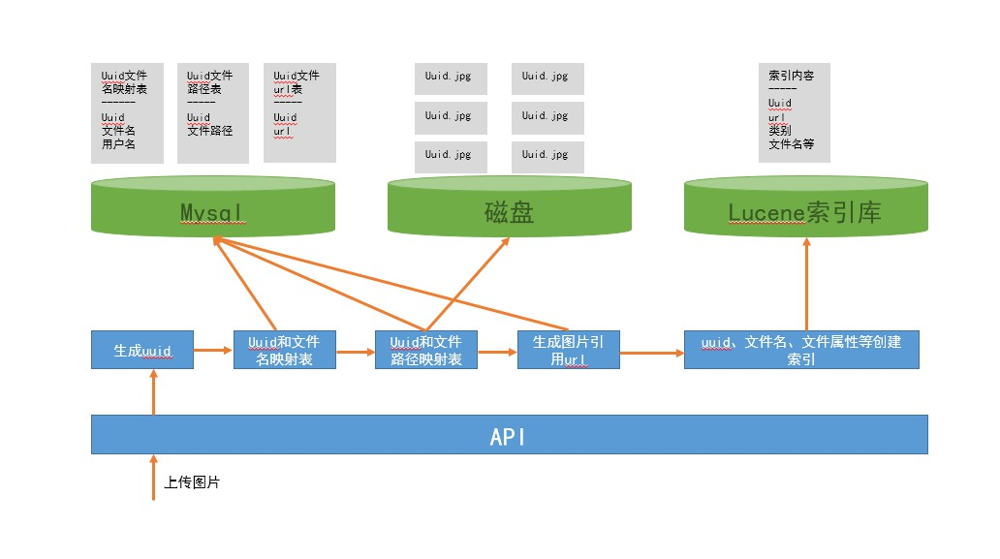

# image-center

用来管理应用中涉及到的图片

## 待实现功能

- 上传图片
- 异步上传图片
- 将图片根据分类存储到硬盘固定位置
- 使用uuid值来命名存储到硬盘的图片，将图片名称和uuid值的映射关系存表
- 计算图片md5值
- 相同md5值的图片不重复保存，只在表中增加记录
- 支持给图片打标签
- 提供图床功能
- 支持根据条件检索图片（名称、分类、标签等）

## 图片服务器

目前使用的是nginx作为图片服务器

### 安装nginx

下载nginx的windows版本，解压，使用start nginx命令启动即可

[windows上使用nginx](http://nginx.org/en/docs/windows.html)

### nginx提供图片服务

在nginx.conf文件中增加location /images/部分

```nginx.conf
    server {
        listen       80;
        server_name  localhost;

		location /images/ {
			root E:/images/uploadfile;
			index  index.html index.htm;
		}
```

这样就可以提供`http://localhost/images/20190205/6f36c28d9f854125976880544c999f7e.jpg`的图片服务了

需要注意的是我们url中包含/images/，我在windows上测试的时候，root对应的文件夹（本例中是E:/images/uploadfile）中必须包含一个文件夹images才可以提供正常的服务，否则会报文件找不到的错误

## 架构设计

架构设计v0.1版主要考虑存储和提供图片url，其他方面先不考虑，可以参考下图


